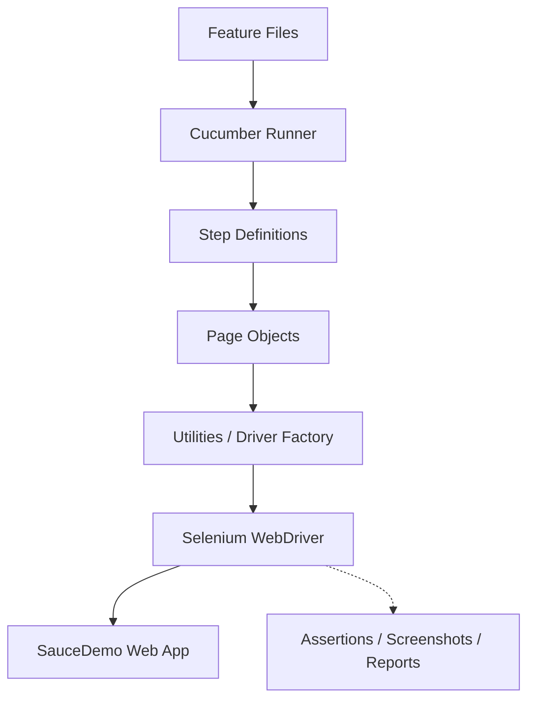

<div align="center">

# E-Commerce Web Application Automation Framework

**A data-driven automation lab for web testing with Selenium, Java, and Cucumber.**

[](https://java.com)
[](https://selenium.dev)
[](https://cucumber.io)
[](https://testng.org)
[](https://maven.apache.org)

</div>

## Why This Exists


Manual testing of e-commerce critical flows like login, product selection, cart management, and checkout is time-consuming and error-prone. This capstone project serves as an end-to-end web automation lab that automates these exact flows to ensure functional stability across regressions.

### Objectives
- Implement a Test Automation Framework using **Page Object Model (POM)**.
- Enable Behavior Driven Development (BDD) using **Cucumber** and **Gherkin**.
- Support data-driven testing and cross-browser execution.
- Generate HTML test reports and automatically capture screenshots on failure.

<br clear="all">

## Framework Architecture


## Project Structure
- `src/main/java/pages`: Page Object classes (POM)
- `src/main/java/utils`: Reusable utility classes (Driver, Config, Wait, Screenshot)
- `src/main/java/constants`: Framework constants
- `src/test/java/stepdefinitions`: Cucumber step definitions mapping to Gherkin steps
- `src/test/java/hooks`: Cucumber setup and teardown hooks
- `src/test/java/runners`: TestNG test runner for Cucumber
- `src/test/resources/features`: Gherkin feature files
- `src/test/resources/config`: Configuration properties (browser, URL, etc.)

## Test Coverage


We automate **11 Scenarios** across critical user journeys:

- **Login**: Valid login, Invalid login, Locked out user, Empty credentials.
- **Products**: Verify products visibility, sort by price (low to high, high to low), add to cart.
- **Cart**: Verify cart contents, remove items, verify cart is empty.
- **Checkout**: Successful checkout process, invalid checkout without required postal code.

<br clear="all">

## Failure Handling

When a scenario fails, a screenshot is automatically captured with a timestamp and saved in the `screenshots/` directory. It is also embedded directly into the Cucumber HTML report.

## Prerequisites
- Java JDK 17 or higher
- Maven installed
- Chrome or Edge Browser installed

## How to Run

1. **Run all tests**:
   ```bash
   mvn clean test
   ```

2. **Run on specific browser** (Overrides config.properties):
   ```bash
   mvn test -Dbrowser=chrome
   mvn test -Dbrowser=edge
   ```

3. **Run specific tags** (e.g., only smoke tests):
   ```bash
   mvn test -Dcucumber.filter.tags="@smoke"
   ```

## Reports
After execution, Cucumber generates a native HTML report located at:
`reports/cucumber-report.html`

## Design Decisions
- **Page Object Model (POM)**: Separates test logic from web elements and page-specific actions. Improves maintainability and reduces code duplication.
- **Singleton/Factory (DriverFactory)**: Ensures thread-safe WebDriver instantiation and centralizes browser management.
- **BDD Approach**: Written in Gherkin (Given/When/Then), the feature files act as living documentation, bridging the gap between technical and non-technical stakeholders.

---
<div align="center">
  <sub>Visuals sourced from <a href="https://github.com/Anmol-Baranwal/Cool-GIFs-For-GitHub">Cool-GIFs-For-GitHub</a> by Anmol Baranwal.</sub>
</div>
